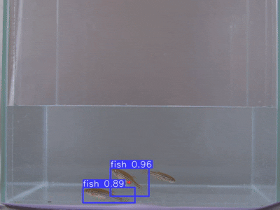

# An algorithm for tracking and predicting the movement of multiple objects

Using a camera, the movement of multiple objects (fish) is analyzed and their tracking is performed. For detection, a YOLOv5 network was retrained to identify the fish. Experiments were also conducted with alternative detection approaches such as Connected Component Analysis and Siamese Neural Networks.

## 🎥 Demo Video. You can watch a short demo of the algorithm in action 

YOLOv5:

Connected Component Analysis

